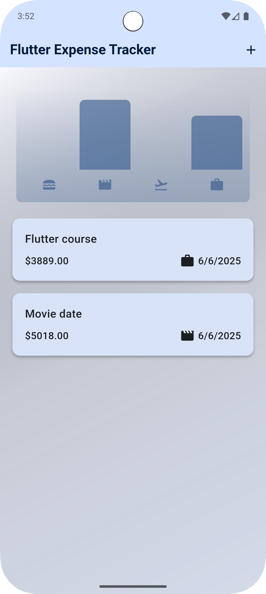
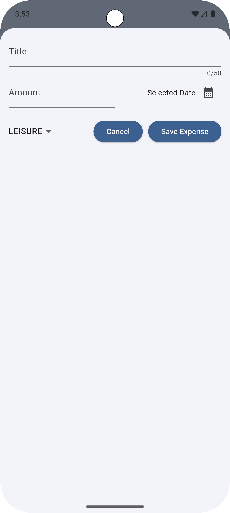

# 💰 Flutter Expense Tracker

A modern Flutter app to **track and manage your daily expenses** with support for **responsive UI** and **dark/light themes**.

## ✨ Features

- 📋 Add, view, and delete expenses
- 🌗 Auto light/dark mode support (based on system)
- 📱 Responsive layout for both mobile and tablet
- 📅 Date picker for selecting expense dates
- 🧾 Categorize your expenses (e.g. Food, Travel, Leisure)
- 📊 Visual summary (chart) of recent expenses

## 📸 Screenshots

<p align="center">
  
  &nbsp;&nbsp;&nbsp;
  
</p>

---

## 🚀 Getting Started

### Prerequisites

- Flutter SDK (3.x recommended)
- Dart SDK
- Android Studio / VS Code

### Setup Instructions

```bash
# Clone the repo
git clone https://github.com/Ayush1350/flutter_expense_tracker.git

# Navigate into the project
cd flutter_expense_tracker

# Get dependencies
flutter pub get

# Run the app
flutter run
```
